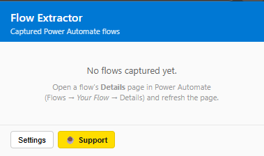
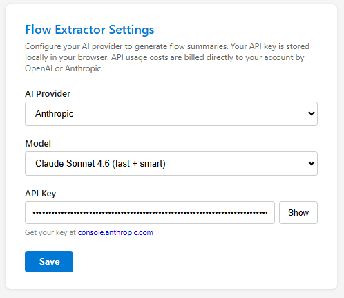
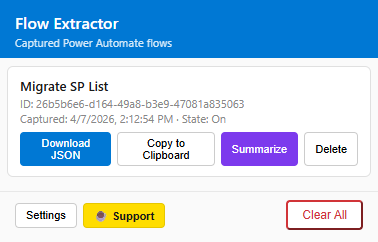

# Power Automate Extractor

A Chrome/Edge extension that captures Power Automate flow definitions directly from network traffic — no HAR export or DevTools workflow needed. Includes optional AI-powered flow summaries via OpenAI or Anthropic.

## Features

- **Automatic Capture** — Intercepts flow definitions from `fetch` and `XMLHttpRequest` as you browse Power Automate
- **One-Click Export** — Download full flow JSON or copy to clipboard
- **AI Summaries** — Generate structured documentation from flow definitions using OpenAI (GPT-4o, GPT-4.1) or Anthropic (Claude Haiku 4.5, Sonnet 4.6, Opus 4.6)
- **Persistent Summaries** — Summaries are saved and restored when you reopen the popup
- **GCC Support** — Works with both `powerautomate.com` and `powerautomate.us`

## How It Works

```
interceptor.js  (MAIN world)  — patches fetch + XHR, posts captured flows via postMessage
       ↓
bridge.js       (ISOLATED world) — relays messages to the extension runtime
       ↓
background.js   (Service Worker) — stores flows, generates AI summaries
       ↓
popup.html/js   (Popup UI) — lists captured flows with download/copy/summarize/delete
```

## Installation (Developer Mode)

1. Open `edge://extensions` or `chrome://extensions`
2. Enable **Developer mode** (toggle in top-right)
3. Click **Load unpacked**
4. Select this project folder
5. Navigate to a flow in [Power Automate](https://make.gov.powerautomate.us) — the extension captures flow definitions automatically

## Usage

1. Open any flow in Power Automate (the flow editor or details page)
2. The extension badge shows `!` when a flow is captured
3. Click the extension icon to open the popup
4. For each captured flow you can:
   - **Download JSON** — saves the full flow definition as a `.json` file
   - **Copy to Clipboard** — copies the formatted JSON
   - **Summarize** — generates an AI-powered breakdown of the flow (requires API key)
   - **Delete** — removes from the captured list

## AI Summary Setup

1. Click **Settings** in the popup footer
2. Choose a provider (OpenAI or Anthropic)
3. Select a model
4. Enter your API key
5. Click **Save**

Summaries include: overview, trigger details, step-by-step actions, connections used, and error handling notes.

> **Note:** AI summaries require your own API key. API usage costs are billed directly by OpenAI or Anthropic.

## Project Structure

```
power-automate-extractor/
├── manifest.json       MV3 extension manifest
├── interceptor.js      Fetch + XHR interceptor (MAIN world content script)
├── bridge.js           Message bridge (ISOLATED world content script)
├── background.js       Service worker — stores flows, handles AI summaries
├── ai-summary.js       AI API integration (OpenAI + Anthropic)
├── popup.html          Extension popup markup
├── popup.css           Popup styles
├── popup.js            Popup logic — list, download, copy, summarize, delete
├── options.html        AI settings page
├── options.css         Settings styles
├── options.js          Settings logic (provider, model, API key)
├── ExtPay.js           ExtensionPay payment library
├── icons/              Extension icons (16/48/128 PNG)
├── privacy-policy.md   Privacy policy
├── .gitignore
└── README.md
```

## Privacy

See [Privacy Policy](privacy-policy.md).

This extension:
- Only activates on Power Automate domains (`*.powerautomate.com`, `*.powerautomate.us`)
- Stores captured flow data locally in your browser (`chrome.storage.local`)
- AI summary API calls are made directly from your browser to OpenAI/Anthropic using your own API key — no data passes through third-party servers

## Screenshots


The popup's empty state with instructions on how to start capturing flows.


Settings page where you configure your AI provider, model, and API key.


A captured flow with options to download JSON, copy to clipboard, generate an AI summary, or delete.

## Compatibility

- **Chrome** 109+ (MV3, `world: "MAIN"` support)
- **Edge** 109+ (same Chromium base)
- Targets `*.powerautomate.us` and `*.powerautomate.com`
